# 1.配置MariaDB

## 數據庫軟件

### 前言
MariaDB 是一個相容於 MySQL 的開放原始碼資料庫，絕大部分的 MySQL 資料庫應用都可以直接以 MariaDB 取代，以下是在 Windows 10 中安裝 MariaDB 的過程

### 安裝
步驟 1
開啟 [MariaDB 官方網頁](https://downloads.mariadb.org/) ，選擇要安裝的 MariaDB 資料庫版本 (建議安裝最新版本)

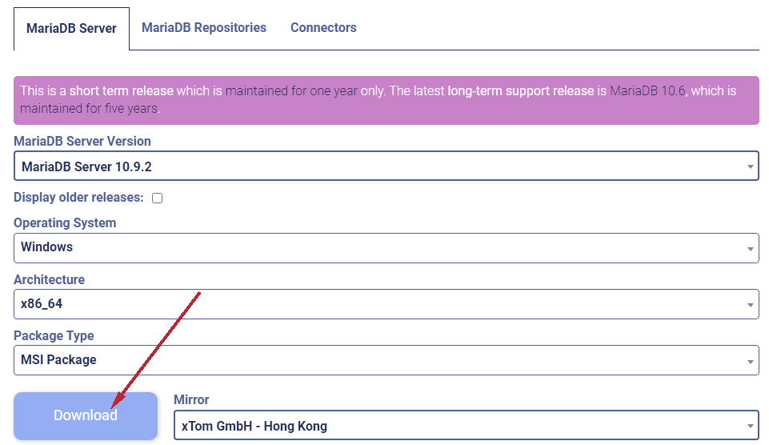

步驟 2
直接執行下載的安裝檔，開始進行 MariaDB 資料庫的安裝

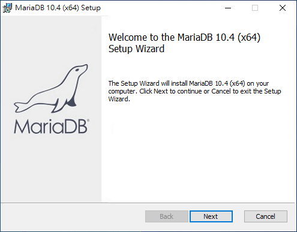

步驟 3
這是 GNU GPL 開放原始碼授權條款，點選「I accept …」之後按下「Next」

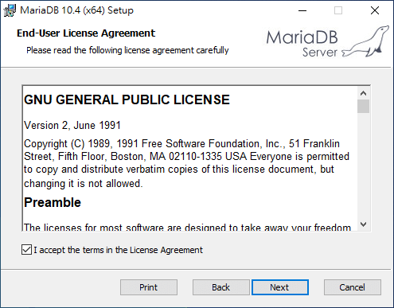

步驟 4
選擇要安裝的原件，若無特殊需求就使用預設值即可

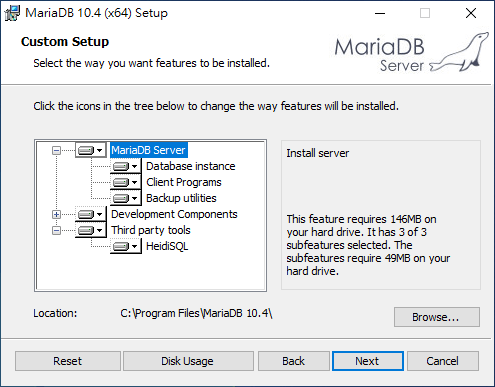

步驟 5
設定 MariaDB 資料庫的 root 管理者密碼，如果需要從遠端以 root 進入資料庫，則可將「Enable access from remote machines for ‘root’ user」打勾 （一般是不需要）

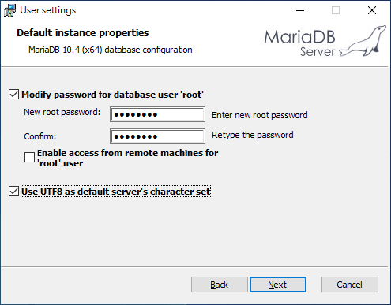

步驟 6
設定 MariaDB 伺服器服務的系統參數，這部分通常也不用更改，使用預設值即可

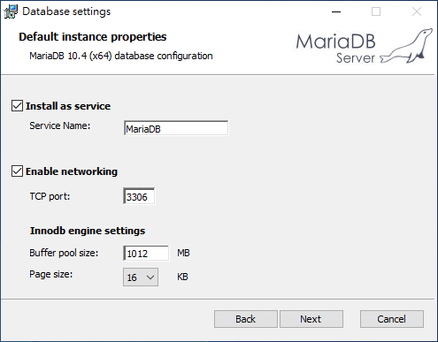

步驟 7
這是詢問是否要將系統的統計資訊回饋給 MariaDB 的開發者，協助 MariaDB 的發展，若想回饋開發者，就把這個選項打勾

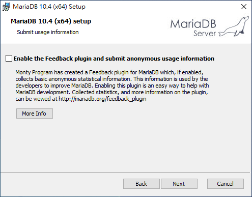

步驟 8
確認所有設定都正確之後，按下「Install」正式進行安裝

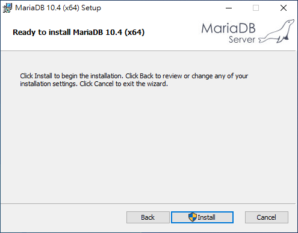

步驟 9
等待安裝過程

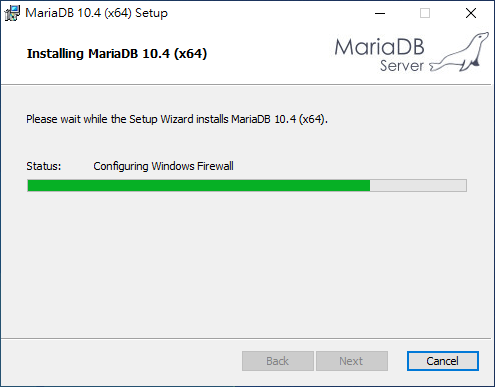

步驟 10
等待安裝過程

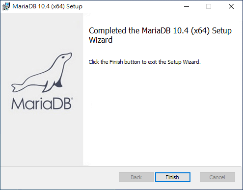

步驟 11
在安裝完成後，MariaDB 伺服器會自動啟動，若要使用 MariaDB 資料庫，可從 Windows 主選單中，找到剛安裝的 MariaDB 目錄，使用 HeidiSQL 資料庫管理工具，或是最傳統的 MySQL Client 指令介面來操作。另外 Error Log 可以用來查看 MariaDB 伺服器的錯誤訊息

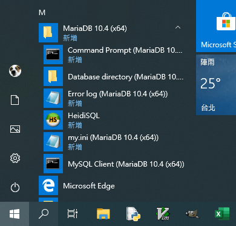

## 數據庫管理工具

### 安裝
[HeidiSQL](https://www.heidisql.com/download.php) 是一套免費的資料庫管理工具，開啟時先新增資料庫的設定，輸入 root 的密碼，其餘用預設值即可，點選「保存」後再點選「打開」

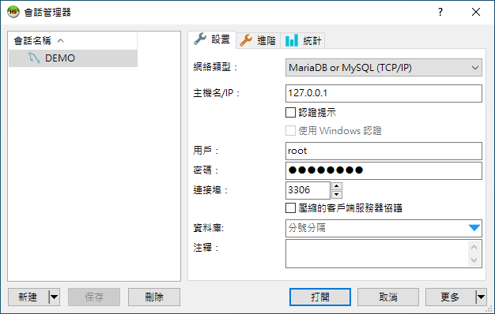

這樣就可以連線至剛剛裝好的 MariaDB 資料庫中了

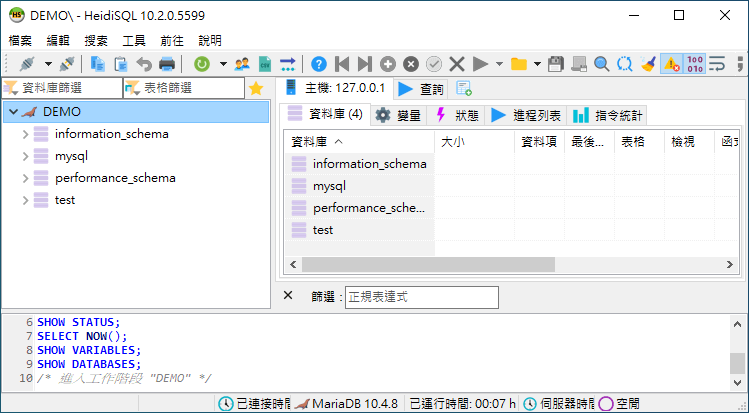