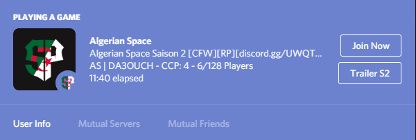

# Rich

## 簡述

它將為玩家的 Discord 狀態添加遊戲狀態及操作按鈕,你可以最多放置 2 個連結,例如 ```群組邀請碼``` 和 ```直連Fivem```

## 配置
```jsx title="config.lua"
Config.Buttons 配置你的Discord按鈕
Config.RichAppId 輸入 Discord Bot App id (https://discord.com/developers/applications)
Config.RichAssetId 輸入 Discord Bot 圖片 id
Config.RichUseKMH 是否以 KM 作單位
```

## 截圖

