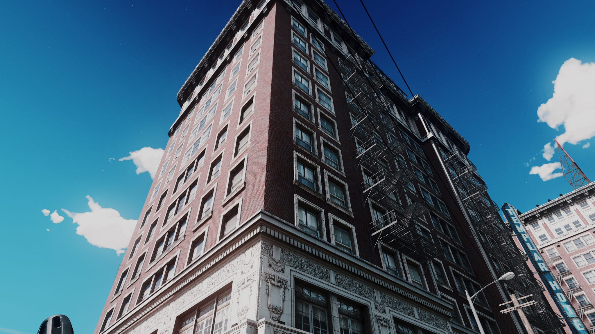

# graphics

## 簡述

令人驚嘆的客戶端和伺服器端圖形處理器

## 安裝

除伺服器端啟動插件外,可向玩家提供 AppleGraphics.zip 檔案安裝在客房端 FiveM.app/citizen 內達至最好的效果

## 天氣系統

100% 從頭開始重寫天氣,沒有忽略任何細節。所有天氣都經過精心設計,以提供令人驚嘆的日出/日落,以及傍晚、夜晚和白天。所有天氣都可以自然地融合在一起,並創造出讓你喘不過氣來的形象

所有天氣都可以自然地融合在一起,並創造出讓你喘不過氣來的形象

- 模擬全局照明
- 完美的陰影級聯,具有擴展的距離和強度
- 全新的時間週期修改器為第三人稱和第一人稱視角提供令人驚嘆的色調映射
- 降低和重新配置霧氣,營造出自然而迷人的風景,營造出完美的氛圍
- 降低鏡頭偽影,消除色差、噪點和環境模糊,以獲得清晰的視野
- 添加了全新的運動模糊、景深效果和額外的散景,以獲得完美的畫面效果
- 為一天中的所有時間新添加的體積照明
- 全新的天氣粒子效果,包括完全原始的大氣霧/霧、花粉粒子、灰塵和風碎片
- 為遊戲中每一個人的水單獨製作直射光。提供迄今為止最好看的水
- 更多基於位置的時間週期編輯,為城市和鄉村的特定區域提供自定義觸摸
- 夜間有限的城市光污染
- 100% 定制雲帽、週期和顏色
- 額外的色彩校正和 postfx 分別應用於每種天氣,以實現完美平衡
- 全新的 hbao 設置,去除奇怪的光氣泡和其他錯誤
- 用全新的紋理、閾值和曝光限制更正了電暈
- 增加和微調全局反射

## 色彩校正

只有 ReShade 提供的最好的。完美的色彩校正、光暈、色調映射等……
15 種以上的 ReShade 選項,以你想要的方式自定義遊戲的外觀！

完美的色彩校正、光暈、色調映射等等……

對於無法運行 ReShade 2.0 的用戶,舊版本 ReShade 中的備用預設

- 改變的天空強度、太陽強度和顏色、恆星能見度、月亮顏色、鉻反射、車輛金屬和玻璃反射、車輪和輪輞反射、車輛前部和背光
- 強度、光斑強度、水反射和光精靈,所有這些都通過使用 ENB 外部著色器實現
- 通過提供的 enb 和 reshade 著色器進一步自定義遊戲外觀的替代指南

## 紋理

全新令人驚嘆的 4K 紋理,極大地改善了 GTA 5 的外觀

- 用於廣告牌、商用車輛、拖車、公交車站和出租車廣告的全新、真實的公司紋理
- 道路！-  (大部分)所有道路紋理都被替換為 100% 自定義法線和高光貼圖紋理。包括道路損壞、人行橫道、人行道、路緣石、障礙物等
- 全新的傷害疊加紋理
- 所有地面碎片的新紋理,包括汽水瓶/罐頭、報紙、信件碎片等
- 槍口閃光、示踪劑、碎片和其他破壞性/武器相關的紋理
- 全新的車輛污垢紋理
- 改變了所有大燈的紋理,用更自然的顏色去除了舊的和醜陋的黃燈
- 農村大部分地區的定制地面和岩石
- 4k 紋理：植物、樹木、灌木、草、火、爆炸、粒子效果、水、雲、穹頂等等

## 效果

精美的視覺效果,讓遊戲感覺更逼真

- 大大增加了所有相關效果的粒子數
- 所有環境粒子效果現在都處於活動狀態
- 地面碎片以自然力量吹動
- 樹葉從樹木、灌木、灌木和棕櫚樹上落下,更加稠密
- 垃圾車以更高的速度和密度吹出紙張和垃圾
- 操縱水濺效果以獲得更逼真的反應
- 所有輪胎和車輪效果都已更改和增加  (水、泥、污垢、灰塵、草、倦怠、血液等)
- 完全改變的血液效果。較大的入口和出口傷口血液噴出
- 改變血液動畫以提高速度和傳播速度
- 調整了所有血液顆粒的顏色以獲得更自然的吸引力