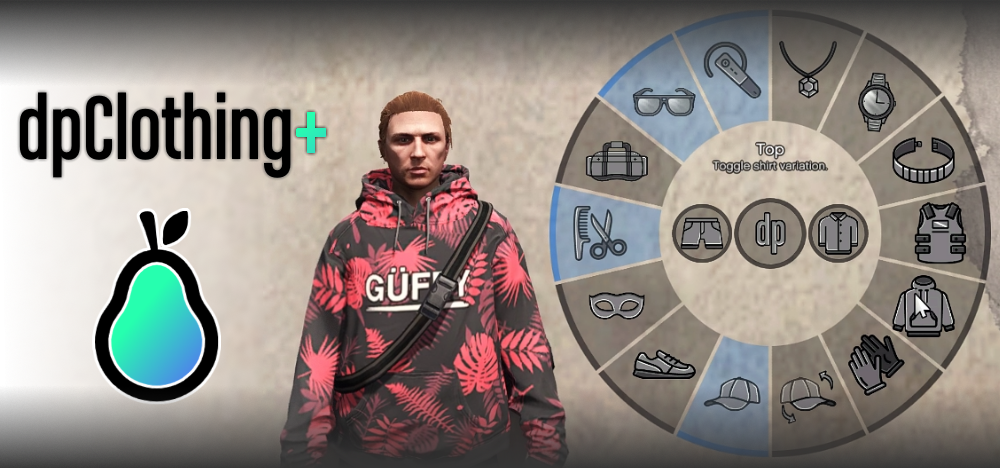

# cloth

## 簡述

變體改變了你裝備的衣服的外觀，一個穿上/脫下的切換開關

## 使用方法

按住 Y 打開介面或使用以下指令
```md
/bag		(變體)
/bracelet	(切換)
/ear		(切換)
/glasses	(切換)
/gloves		(變體)
/hair		(變體)
/hat		(切換)
/mask		(切換)
/neck		(切換)
/pants		(toggle)
/shirt		(切換) (也脫掉手套)
/shoes		(切換)
/top 		(變體)
/visor		(變體)
/watch		(切換)
/revertclothing    (只需將每個保存的項目重新打開)
/bagoff     (切換)
/clothingexit (如果菜單卡在打開狀態)
```

## 配置

```jsx title="apple_clothing/Client/Config.lua"
ExtrasEnabled 額外使用命令控制
Debug 調試模式
```

如果你添加/更改了預設安裝的服裝檔案，你可能需要重新搜索 ```空裝``` 的服裝代號

```jsx title="apple_clothing/Client/Clothing.lua"
Drawables
```


## 截圖

