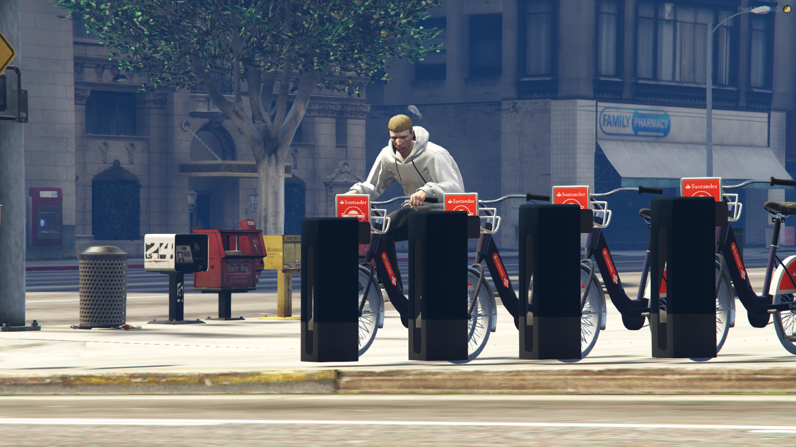

# Bike

## 簡述

通過多個在玩家之間完全同步的停靠站為地圖添加了 ```逼真的自行車租賃體驗``` 這些允許玩家走到機器前並租用自行車，他們還可以將租用的自行車帶回任何停靠站以將其歸還

這對於讓您的玩家通過沿途租用自行車快速從一個車庫到另一個車庫非常有用。該資源有許多預先配置的停靠位置，但是您始終可以在配置文件中添加更多

由於自行車共享計劃因地區而異，此資源可以很容易地重新構造到另一個國家，包括的默認模型適用於倫敦、英國和桑坦德自行車租賃計劃

您可以步行到自行車停靠站的任何一台機器上租一輛自行車。一旦你在機器上，一個提示會要求你按ENTER（這個鍵可以在配置中配置）來租一輛自行車

如果有可用的自行車，位置將用標記亮起綠色，自行車將解鎖，允許玩家移動它。他們將在遊戲中收到通知，現在已為他們解鎖。這與所有其他玩家同步，意味著他們將無法再從該位置租用自行車

每個位置的自行車數量各不相同，地圖周圍的一些位置只有 3 個車站，而其他位置有 5 個

- 租一輛自行車 ```如果有自行車，您可以走到機器旁輕鬆租用它```

- 在任何地方歸還自行車 ```從一個位置租用自行車後，您可以在任何地方歸還！```

- 圖標 ```地圖上的圖標將實時向玩家顯示每個停靠站有多少自行車可用（可配置）```

- 冷卻 ```在配置中，您可以啟用冷卻 - 這是在幾分鐘內，需要玩家在租用另一輛自行車之前等待```

- 自動重置 ```在繁忙的公共服務器上，玩家可能不會傾向於歸還他們租用的自行車。這可以在配置中啟用，並且在可配置的時間後，租用的自行車將自動在位置 “重置”，允許其他玩家租用它。這可以在配置中簡單地打開/關閉```

- 權限檢查 ```您可以通過編輯服務器端文件輕鬆添加權限檢查，或根據銀行餘額添加檢查，要求人們付費租用自行車```

## 配置

```jsx title="config_policeshields.lua"
main = {
	spawnBikeInDistance = 50.0, -- 在可用插槽中生成自行車的距離（以優化性能）
	machineUsageDistance = 2.0, -- 租用自行車距離機器的距離
	machineKey = {0, 191},
	returnKey = {0, 191},
	bikesAvailable = 100.0, -- 這是每個位置可用自行車的百分比。例如，50% 意味著服務器啟動時每個位置有 2/4 輛自行車
	enableBlips = true, -- 啟用 blips
	blipName = "自行車租賃", -- 這顯示每個位置有多少輛自行​​車
	blip = 226,
	blipShortRange = true，
	blipScale = 1.0,
	blipColor = 1,
	blipDisplay = 4,
	returnDetectionDistance = 1.0，
	enableAnimation = true,
	animDict = "amb@prop_human_atm@male@enter",
	animName = "enter",
	hireCooldown = true，
	hireCooldownTime = 5, -- 玩家可以租用另一輛自行車前的 5 分鐘冷卻時間
	enableResetBike = true, -- 這會打開/關閉自動重置，最適合公共服務器保持開啟
	time = 10, -- 10 分鐘後自動將自行車重置到位置
}
```
配置文件允許你配置很多東西，甚至可以在自行車被租用一段時間後重置，例如 10 分鐘。這對於玩家可能不會自己歸還自行車並且您想要重置它的公共服務器非常有用，從而為其他人提供足夠的自行車

您可以配置默認生成的自行車的百分比。例如，如果您希望在服務器啟動時所有的位置都是半滿的，請將 bikesAvailable 設置為 50.0 而不是 100.0

## 截圖




## 影片

<iframe width="560" height="315" src="https://www.youtube.com/embed/mRDbYYMPVV4" title="YouTube video player" frameborder="0" allow="accelerometer; autoplay; clipboard-write; encrypted-media; gyroscope; picture-in-picture" allowfullscreen></iframe>