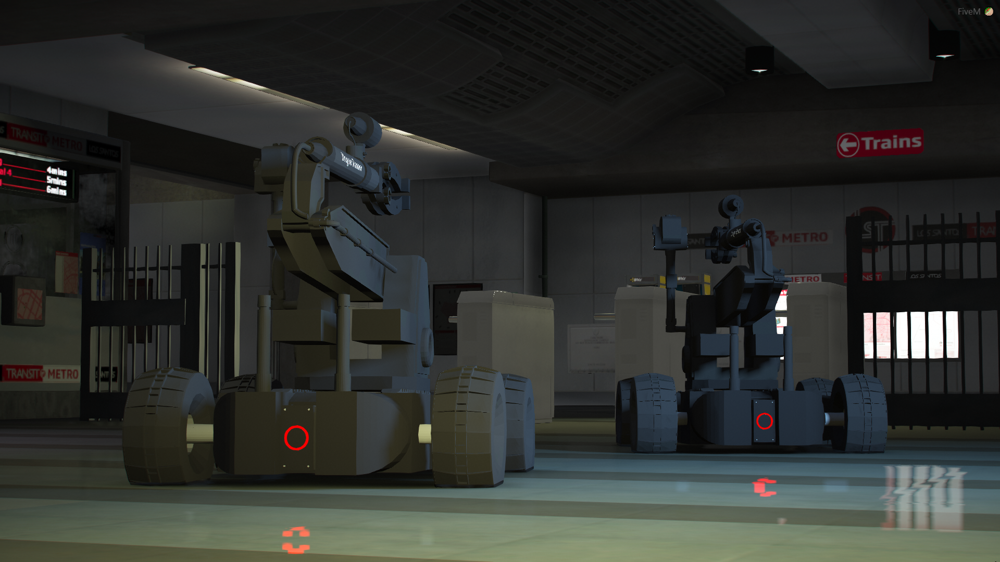
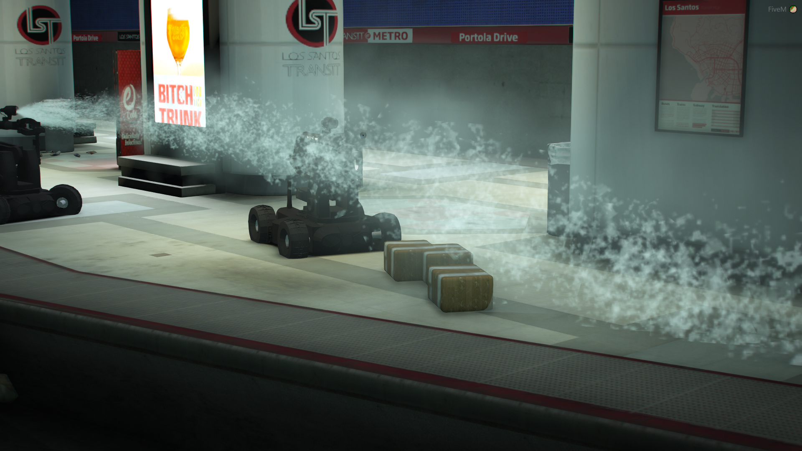
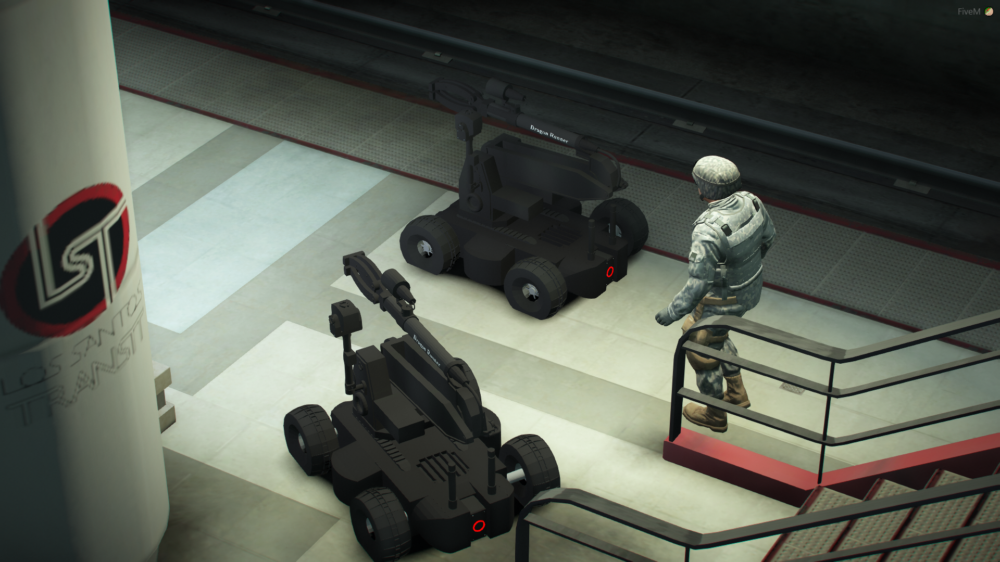
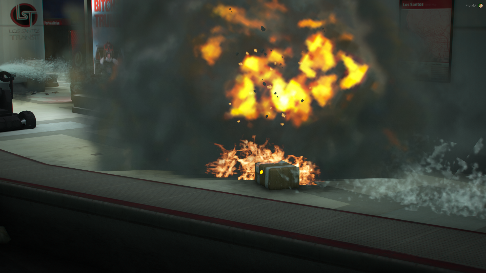
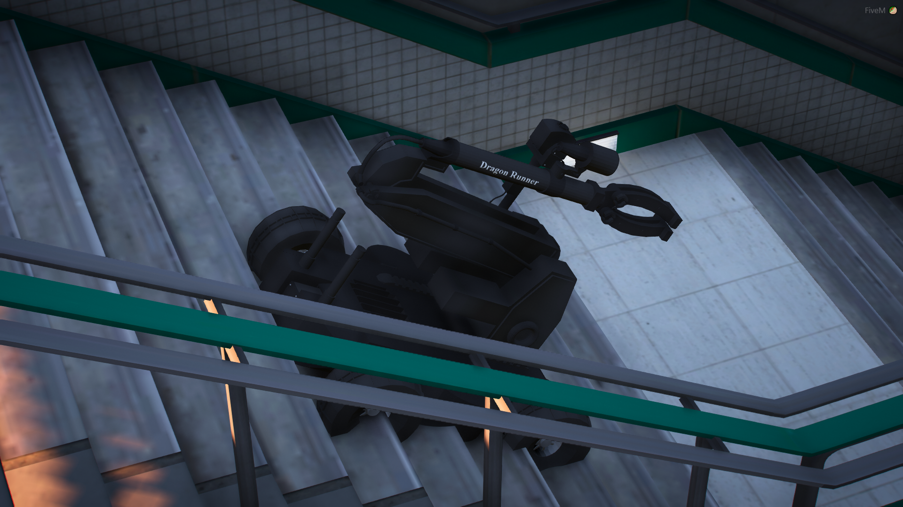

# EOD

## 簡述

允許玩家設置和使用遙控拆彈機器人 (EOD)。完全可控的，並包括一系列逼真的功能，例如進行受控爆炸的能力、從機器人射出水流的能力以及啟用直播攝像頭的能力。這意味著您將能夠在遠離威脅的情況下觀看機器人上的實時攝像頭。夜視將幫助您在黑暗中

- 創建和移除遙控排爆機器人 ```只需執行 /eod 即可在您面前設置一個新機器人。屏幕顯示將有助於通知玩家按鍵綁定以操作它。機器人的移動由方向鍵控制，它能夠遠離玩家移動很遠的距離```
- 啟用來自機器人的實時流媒體視頻 ```無論您離多遠，您都可以輕鬆啟用實時流媒體攝像頭，徹底改變角色扮演體驗。您將能夠看到機器人在拐角處移動並進入建築物以確保場景安全```
- 啟用夜視模式 ```在某些角色扮演情況下，您將在夜間處理潛在的不安全環境。啟用夜視模式可讓您照亮該區域並通過實時流式傳輸相機清晰地看到```
- 射出水流 ```這個令人興奮的功能允許您開始從機器人射出高壓水流。這與所有玩家完全同步，並在角色扮演場景中用於解除炸彈 (電線) 或防止受控爆炸在該區域產生火災```
- 受控爆炸 ```在某些情況下，唯一的選擇是進行受控爆炸。按下按鈕即可激活此功能，並開始倒計時。如果玩家願意，他們可以在最終引爆之前取消此操作。如果玩家在爆炸附近，這具有音頻和效果。可能會發生小火，水射流可以減輕這種情況```

## 截圖









