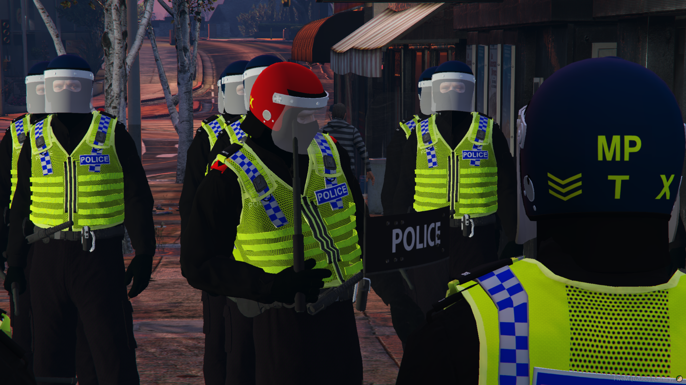
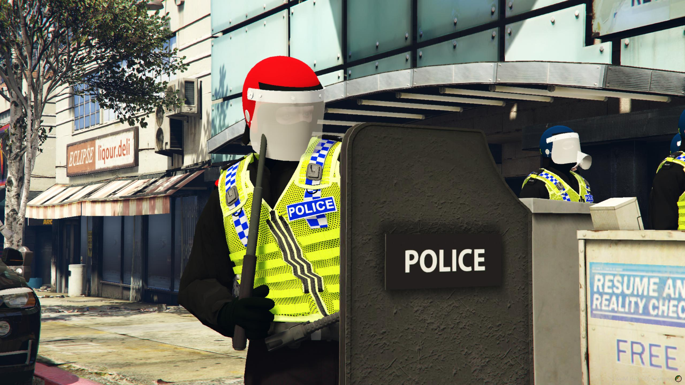
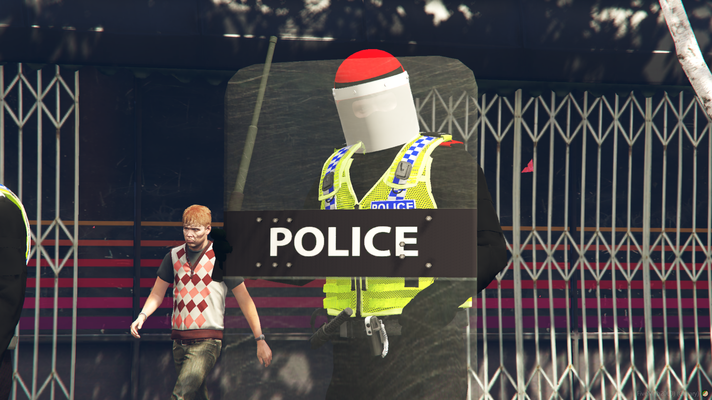
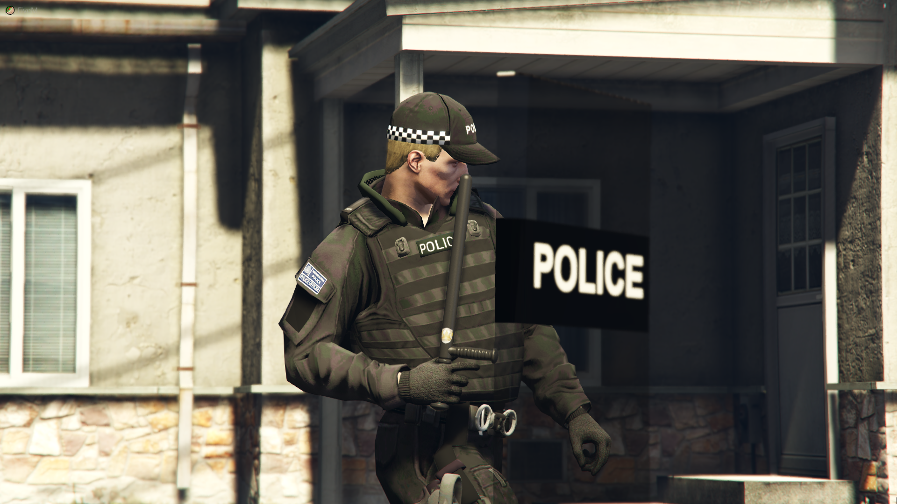
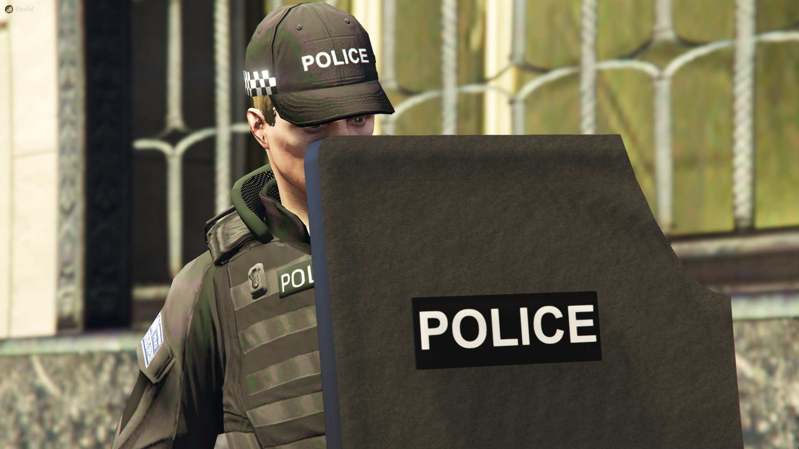
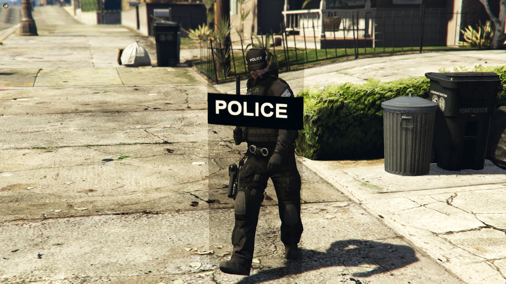
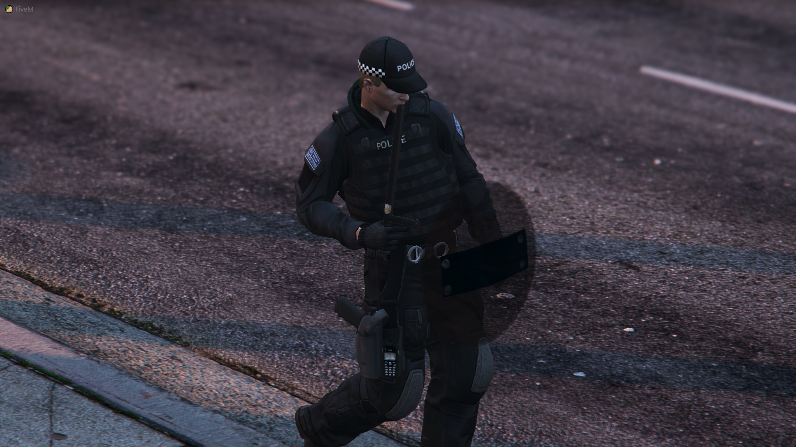

# Polices

## 簡述

添加了八個逼真的警察盾牌，用於從槍支到公共秩序的不同情況。這些最終將增強您的警察部門/部隊的能力，使他們既可以創造更好的角色扮演，又可以更好地處理事件

該腳本現在包含八個盾牌

:::tip 用法
/shield [名稱]

這允許你開始使用警察盾牌。在聊天中，命令建議將向您顯示可用的不同盾牌名稱。例如 ```/shield CTSFO```（您可以在配置中更改名稱）
:::

這將使您進入動畫並在盾牌中生成。這是我們能找到的最好的動畫，仍然允許您使用右臂移動和射擊。

該腳本適用於進出車輛，這意味著您無需暫停角色扮演即可在上車之前禁用您的盾牌。您可以禁用碰撞，這意味著盾牌將不再能抵禦子彈。

:::danger 禁用
要禁用你的盾牌，要麼切換到另一個盾牌，要麼在不選擇盾牌類型的情況下輸入 ```/shield```
:::

- 指令使用警用盾牌 ```只需運行一個命令，您就可以開始使用警用盾牌，您可以在四種可用選項之間進行選擇```

- 菜單使用警用盾牌 ```已配置 esx_policejob 菜單上可直接使用警用盾牌，您可以在四種可用選項之間進行選擇```

- 適用於車輛 ```我們已經看到當玩家進入車輛時，其他護盾資源會出現故障。我們已經確保我們的資源不會發生這種情況```

- 阻擋子彈 ```我們的盾牌可以阻擋子彈，因為它們啟用了碰撞。您可以在配置文件中禁用此功能```

- 權限檢查 ```您可以輕鬆添加權限或工作檢查```

## 配置

```jsx title="config_policeshields.lua"
第一部分稱為 main，允許您設置以下內容：
    main = {
        commandName = "shield",
        commandChatSuggestion = "使用警用盾牌",
        parameterType = "盾牌類型",
        acePermissionsEnabled = false，--如果為 true，則啟用 ace 權限
    }
```

最後，您可以編輯每個盾牌的位置、動畫和名稱

## 截圖













