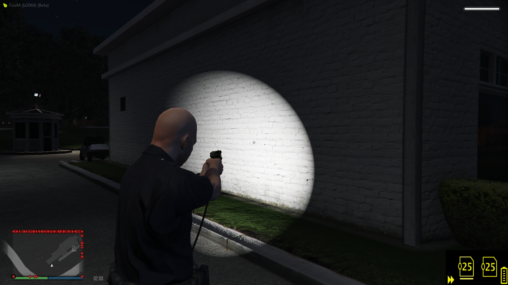
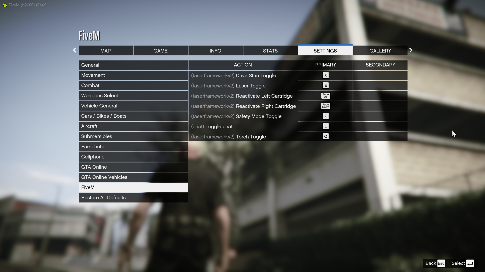

# SmartT

## 簡述

智能泰瑟槍提供先進而逼真的泰瑟槍體驗，具有許多功能，例如完全同步的激光瞄準器和手電筒、包括彈藥筒物品

- 界面 ```CID（中央界面顯示）是真實的，可以使用自定義圖標輕鬆向您顯示泰瑟槍中加載了哪些彈藥筒``` 

- 紅色激光 ```我們添加了紅色激光，因此您可以精確瞄準嫌疑人。這與所有玩家完全同步，因此您可以開始打紅點罪犯```

- 手電筒 ```內置手電筒可以輕鬆切換，就像激光一樣，它完全同步。晚上使用泰瑟槍變得更加容易```

- 彈藥筒 ```您的泰瑟槍可以裝載兩個彈藥筒，你需要持有彈藥筒的物品才能換上彈藥```

- 3D 自定義聲音 ```我們添加了自定義聲音，但這次它們是 3D 的，使體驗更加逼真```

- 泰瑟槍安全 ```您可以輕鬆切換泰瑟槍安全模式，其狀態將顯示在 CID（界面）上。如果啟用，您將無法部署泰瑟槍``` 

- Taser Arc 模式 ```只要您離他們足夠近，您就可以在不部署您的泰瑟槍的情況下擊暈其他玩家```  

- 手動移除倒鉤 ```泰瑟槍人員可以在部署後輕鬆移除玩家的倒鉤，防止它們被重新激活```  

- 自動倒鉤移除 ```泰瑟槍倒鉤將根據玩家與軍官的距離自動移除，從而導致它們被撕掉```

- 彈藥追蹤 ```我們仍然通過 Discord 獲得 Axon Audit 跟踪，記錄泰瑟槍的每次使用情況。我們還為真實目的生成泰瑟槍設備和彈藥筒 ID```

## 物品

```jsx title="ox_inventory/data/items.lua"
taser_cartridge
```

## 截圖






## 影片

<iframe width="560" height="315" src="https://www.youtube.com/embed/hSLb9YpT5w4" title="YouTube video player" frameborder="0" allow="accelerometer; autoplay; clipboard-write; encrypted-media; gyroscope; picture-in-picture" allowfullscreen></iframe>