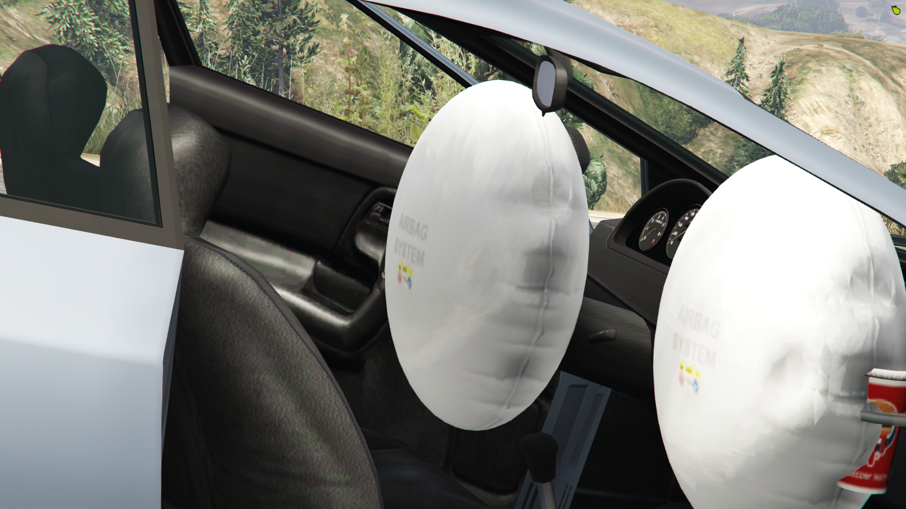
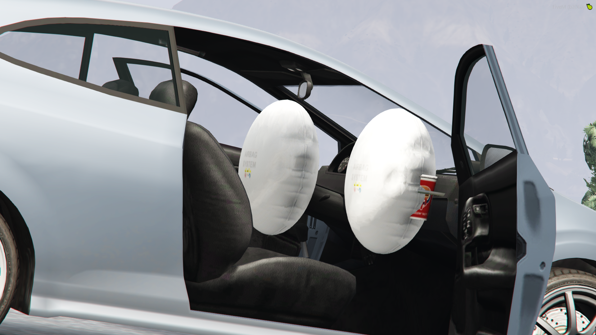
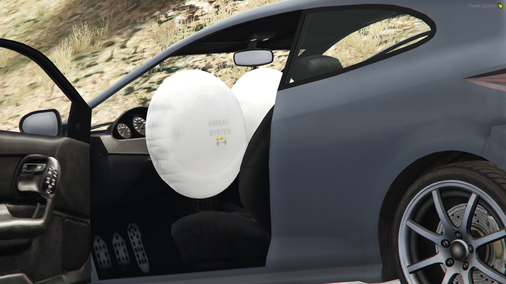

# airba

## 簡述

提供更逼真的車輛碰撞體驗。這最終將增強那些參與碰撞的人的角色扮演，允許自動激活安全氣囊，也可以使用命令手動激活

該插件具有的安全氣囊模型。這適用於除自行車、摩托車、飛機和直升機之外的所有車輛。有些車輛的安全氣囊可能不在正確的位置

- 自動安全氣囊展開 ```這些不會在小碰撞時展開，車輛必須受到足夠的損壞才能展開安全氣囊，其中兩個將展開 - 一個用於駕駛員，一個用於乘客```
- 音效 ```您會聽到安全氣囊展開時彈出的聲音，以及我們逼真的自定義聲音！```
- 通用 ```這些幾乎適用於所有車輛```
- 手動部署 ```/airbag 命令允許手動部署，增強場景中的 RP```

:::tip 指令
/airbag
:::

## 配置

```jsx title="cl_airbag.lua"
local damageLevel = 960.0 您可以設置要檢測的損壞級別，以進行自動部署
local secondsToExpire = 50 可以設置安全氣囊自動展開後的秒數，然後再刪除
```

## 截圖







## 影片

<iframe width="560" height="315" src="https://www.youtube.com/embed/5FRDIApVhbs" title="YouTube video player" frameborder="0" allow="accelerometer; autoplay; clipboard-write; encrypted-media; gyroscope; picture-in-picture" allowfullscreen></iframe>