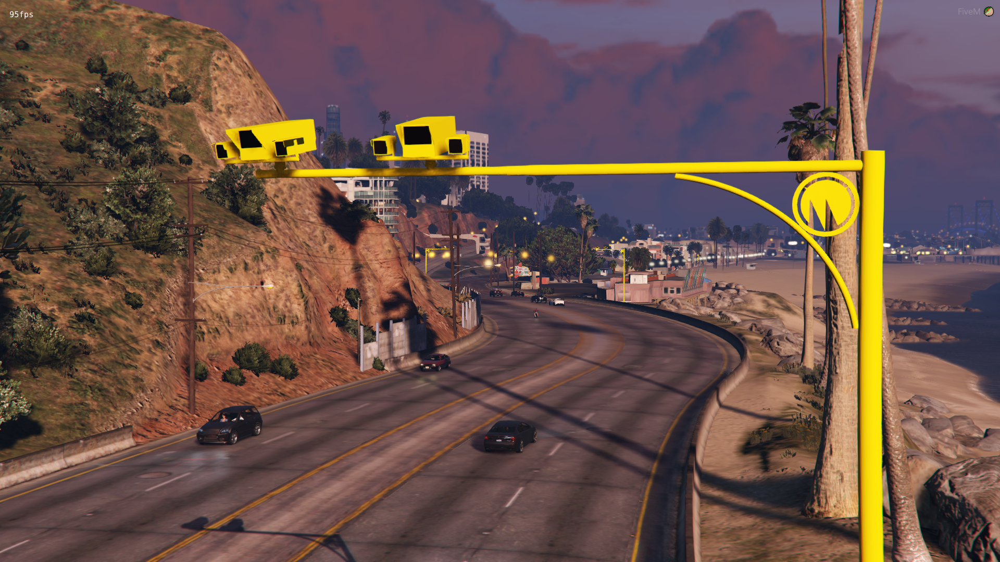
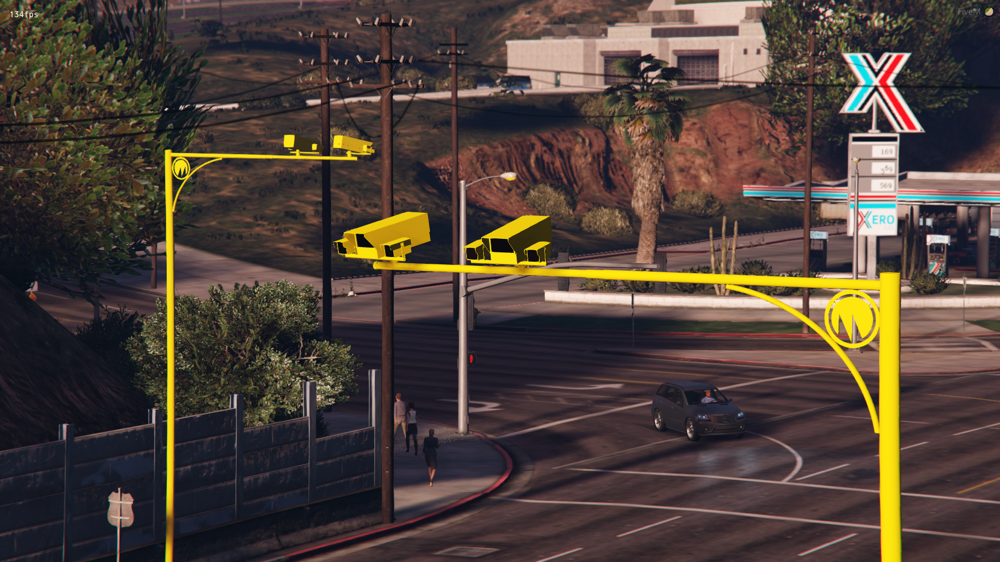

# speedc

## 簡述

提供逼真的平均速度相機體驗以及 Discord  日誌等框架的能力

平均速度相機在某種意義上是獨一無二的，因為它們使用兩個相機，測量在第一個和第二個之間行駛所花費的時間。使用這段時間計算速度，如果超過了該道路的限制，則檢測到駕駛員超速

我們在配置文件中預裝了 40 多組攝像機 (80 個)使其易於安裝和使用。這在世界各地越來越多地使用，特別是在英國，作為防止超速的更有效方法。包含一個自定義模型

- Discord 集成 ```您可以將此資源與 Discord webhook 集成，並接收有關播放器速度的信息```
- 檢測寬減超速 ```輕鬆為超速留出餘地，例如 10% + 2 MPH```
- 添加額外的相機 ```在配置文件中，您可以通過定義坐標和限制輕鬆添加更多平均速度相機位置，當腳本啟動時，它們都會生成```

## 配置

```jsx title="config_averagespeed.lua"
你可以添加更多的攝像頭。我們已經包括了 40 組相機。

只需向表中添加一個已有示例

這需要您設置兩個攝像機的坐標和航向以及速度限制。您可以創建無限的平均速度相機
```

## 截圖






## 關聯插件

[speedw](./speedw)