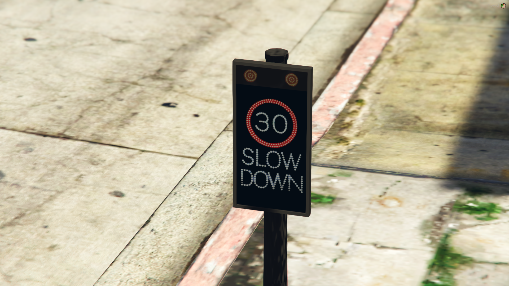
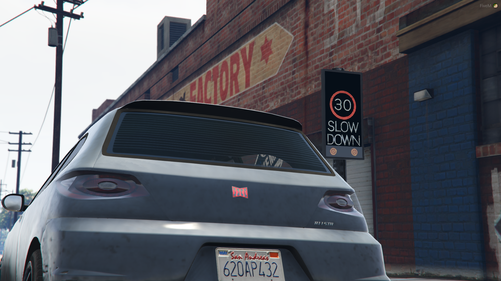

# speedw

## 簡述

在城市周圍增加了速度警告雷達。這些智能設備檢測接近它的交通速度，如果他們超速，標誌會打開並閃爍，提醒司機減速。該資源是高度可配置的，您可以輕鬆添加更多標誌

我們在配置文件中預裝了 60 多個測速雷達，使其易於安裝和使用。該資源包含在配置文件中使用 ```mph/h``` 或 ```km/h``` 的切換，我們為 30、40、50 和 60 ```mph/h``` 或 ```km/h``` 區域提供攝像頭。添加雷達就像選擇坐標和限制一樣簡單

- 車輛激活 ```這些在超速車輛存在時激活，並在車輛不再超速或離開該區域時停用```
- 逼真 ```我們設計的雷達就像現實生活一樣，交替閃爍橙色燈光和減速信息```
- 多個速度限制 ```此資源支持 30、40、50 和 60 mph 或 km/h 限制```
- 發射/明亮 ```這些標誌是發射的，使它們在夜間和白天都有效，控制城市所有時間的速度```
- 高度可配置 ```允許您調整一切，例如從 mph 更改為 km/h 等等```
- 添加額外的雷達 ```在配置文件中，您可以通過定義坐標和限制輕鬆添加更多的速度警告雷達位置，當腳本啟動時，它們都會生成```

## 配置

```jsx title="config_speedwarning.lua"
main{}

允許您在激活雷達之前設置激活的寬減超速。這可以設置為 0.0 超出限制時立即激活。或者，您可以將其設置為 1.0 或 2.0 以留出額外速度

如果已設置，您還可以啟用 km/h 而不是 mph/h 您還應該相應地更改各種雷達的速度限制

最後，您可以設置探測半徑，這是距離雷達最遠的距離，以允許其激活


props{}

允許您編輯和更改使用的道具名稱，如果您希望將它們重新紋理到另一個地方，甚至添加更多的限速道具。您需要了解導出紋理並在 Photoshop 中對其進行編輯，但這應該不會太難
```

在位置部分，您可以添加更多雷達。我們已經包含了 60 多個雷達示例

這需要您設置探測雷達的坐標和航向以及速度限制。您可以創建無限的雷達。如果您決定添加更多限制道具，這些道具也可以在此處兼容，只要它們在 ```props{}``` 部分中定義即可

默認情況下，唯一有效的限制是 30.0、40.0、50.0 和 60.0

## 截圖






## 關聯插件

[speedc](./speedc)