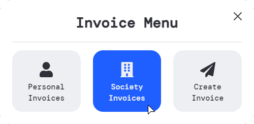
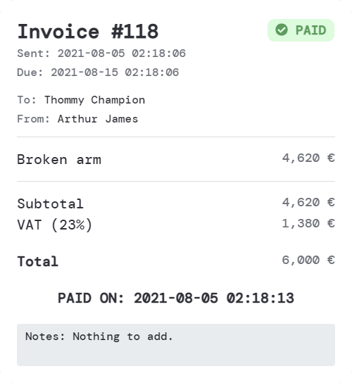
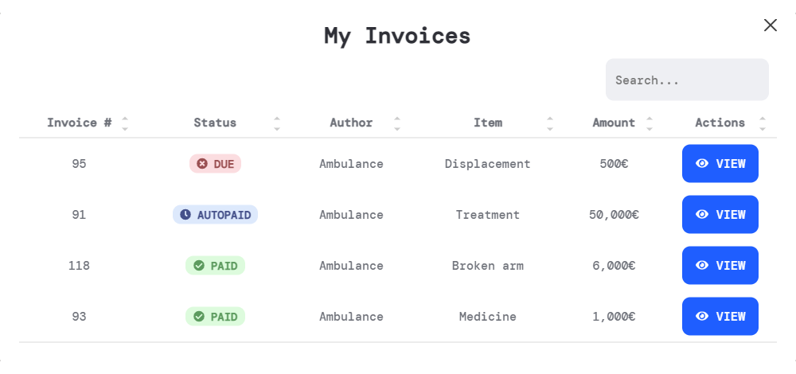
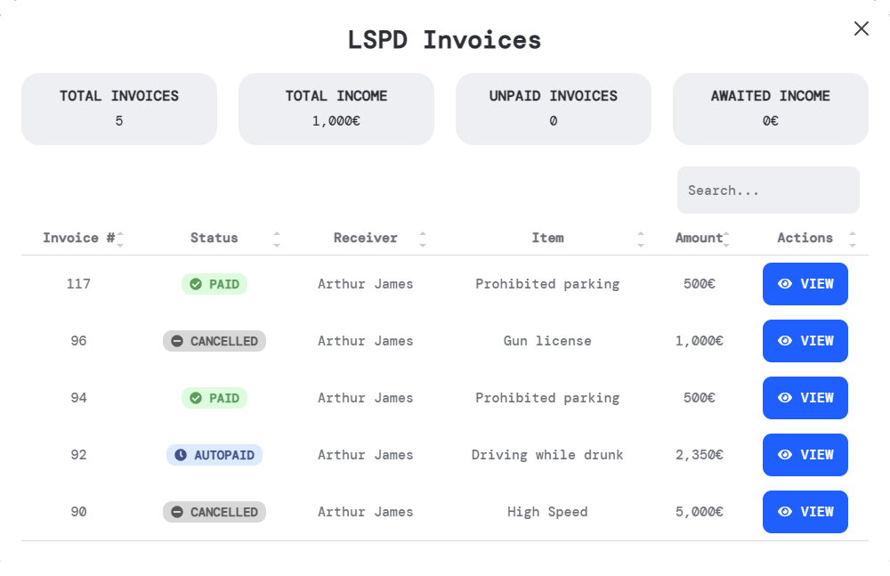

# Bill

## 簡述

這是一個完整的計費系統，具有美觀且用戶友好的界面

:::tip 指令
/invoices
:::

## 配置

```jsx title="config.lua"
Config.InvoicesCommand 允許玩家打開計費菜單的命令
Config.VATPercentage 發票的增值稅百分比 (僅視覺，不會影響最終發票價值)
Config.LimitDate 如果您希望玩家有一個支付發票的截止日期
Config.LimitDateDays 如果截止日期選項設置為真，玩家必須支付多少天的發票
Config.PayAutomaticallyAfterLimit 是否希望系統在截止日期後自動支付發票
Config.FeeAfterEachDay 如果您希望在每天不支付發票後收取每日費用
Config.FeeAfterEachDayPercentage 每日費用百分比
Config.OnlyBossCanAccessSocietyInvoices 要是老闆能看到社會發票就好了
Config.AllowedSocieties 可以向玩家發送發票的社團
```

## 截圖









## 影片

<iframe width="560" height="315" src="https://www.youtube.com/embed/uiqYhhUhrNM" title="YouTube video player" frameborder="0" allow="accelerometer; autoplay; clipboard-write; encrypted-media; gyroscope; picture-in-picture" allowfullscreen></iframe>