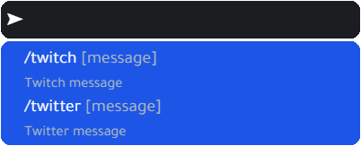
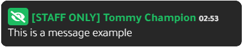

# Chat

## 簡述

- 啟用/禁用任何命令
- 更改命令
- 更改圖標
- 隱藏聊天 ```(/hide)```
- 即使聊天被隱藏，也可以選擇繼續顯示服務器/員工消息
- 在消息上顯示玩家 ID
- 設置玩家 ID 是應該向所有人顯示還是僅對服務器管理員顯示
- 清除聊天
- 任何玩家都可以清除其聊天 ```（/clear）```
- 服務器管理員可以清除全局聊天 ```(/clearall)```
- 不和諧日誌
- 超時系統 ```（mute/unmute玩家輸入聊天）```
- 私信系統
- 自動消息系統 （每 X 分鐘發送一次服務器消息）
:::tip 玩家指令
/me
/do
/try
:::

## 截圖

聊天輸入



Twitter


OOC


ME


DO


TRY


Twitch


YouTube


工作人員（用於發布服務器公告）


僅限員工（服務器管理員限制聊天）



服務器公告（另一種發布服務器公告的方式）


廣告


匿名


工作


警方公告


救護車公告


## 影片

<iframe width="560" height="315" src="https://www.youtube.com/embed/wNEADFOrO7Q" title="YouTube video player" frameborder="0" allow="accelerometer; autoplay; clipboard-write; encrypted-media; gyroscope; picture-in-picture" allowfullscreen></iframe>