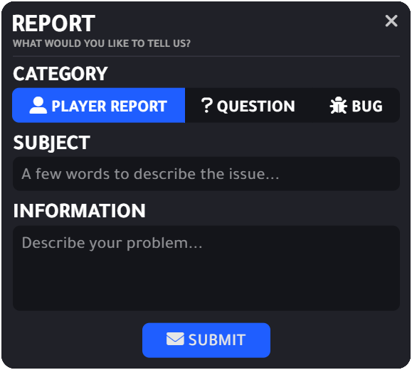
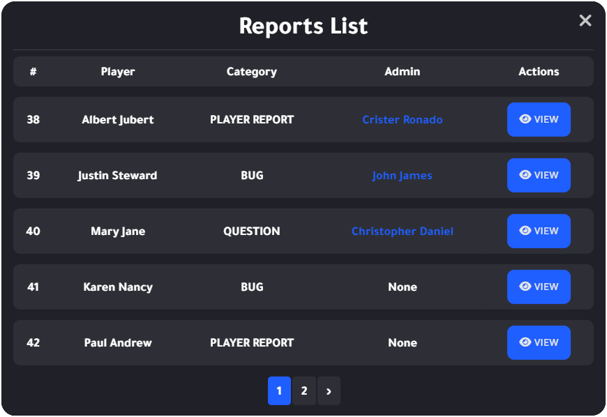

# Report

## 簡述

- 創建新報告時，服務器管理員會收到通知
- 服務器管理員可以禁用新的報告通知
- 玩家只能打開一份報告
- 有一個內置的聊天
- 服務器管理員可以在內置聊天中直接回答玩家，帶上玩家，將自己傳送給玩家並結束報告
- 打開報告後，玩家只能取消報告，如果服務器管理員沒有在報告中進行任何操作 (玩家在聊天中得到回答或被TP後，他將無法再取消報告)
- ```Discord``` 日誌

## 截圖





## 影片

<iframe width="560" height="315" src="https://www.youtube.com/embed/npdN-lOTxo0" title="YouTube video player" frameborder="0" allow="accelerometer; autoplay; clipboard-write; encrypted-media; gyroscope; picture-in-picture" allowfullscreen></iframe>