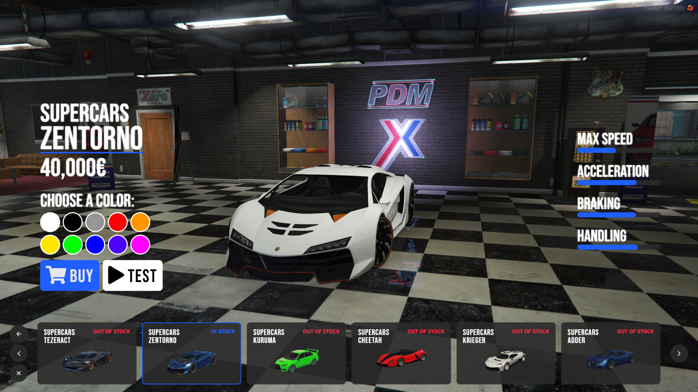
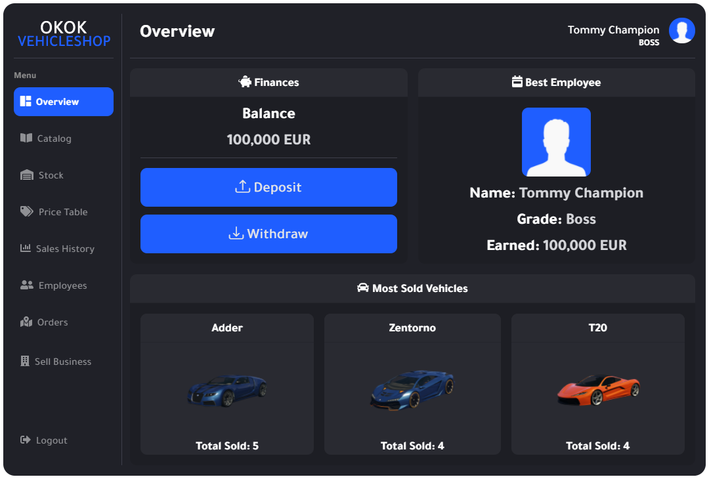

# Vehic

## 簡述

- 汽車/飛機和直升機/船店
- 玩家擁有的經銷商 (玩家可以擁有多個車輛商店)
- 服務器擁有的經銷商
- 員工等級
- RGB/顏色 ID 支持
- 包括管理菜單來管理每個商店
- 試駕
- ```Discord``` 日誌

## 截圖





## 影片

<iframe width="560" height="315" src="https://www.youtube.com/embed/QU4_z2N2he8" title="YouTube video player" frameborder="0" allow="accelerometer; autoplay; clipboard-write; encrypted-media; gyroscope; picture-in-picture" allowfullscreen></iframe>